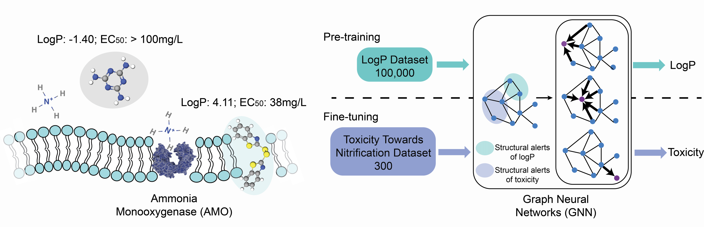

# Leveraging Transfer Learning and Attention-Based Interpretability Enhancement in Graph Neural Networks for Small Environmental Datasets



## Overview
This repository contains the code for the paper "Predicting Toxicity towards Nitrifiers by Attention-Enhanced Graph Neural Networks and Transfer Learning from Baseline Toxicity" 'https://doi.org/10.1021/acs.est.4c12247\'. The project uses transfer learning techniques to learn specific modes of action (toxicity towards nitrification) from baseline toxicity (logP). The interpretability of predictions on small environmental datasets is substantially enhanced with attention mechanisms and Shapley values.

## Installation

### Prerequisites
- Python 3.10.11
- PyTorch 2.0.0
- PyTorch Geometric  2.4.0 
- DeepChem  2.7.1
- RDKit  2023.03.1
- tqdm  4.65.0

### Setup
Clone this repository and install the required packages:
```bash
git clone git@github.com:zhangky12/ToxPred_nitrification.git
cd ToxPred_nitrification
```

## Usage

### Running the Examples
To run the example notebook:
```bash
jupyter notebook examples.ipynb
```
This notebook demonstrates how to load the models, make predictions, and visualize the results using the provided datasets.

### Using the Pre-trained Models
Load and use the pre-trained models as follows:
```python
from model import *
from utils import *

# Load logP prediction model
reg_model_mat = GATEdgeAT(multihead_attention=True, return_attention=True)
reg_model_mat_path = "LogP_regression.pt"
reg_model_mat.load_state_dict(torch.load(reg_model_mat_path, map_location=torch.device('cpu')))
print("Load pretrained model")
reg_model_mat.eval()

# Load toxicity prediction model
baseline_model = GATEdgeAT(multihead_attention=True, return_attention=True)
exp_model = GAT_fine(baseline_model)
exp_model_path = "Tox_classification.pt"
exp_model.load_state_dict(torch.load(exp_model_path, map_location=torch.device('cpu')))
print("Load pretrained model")
exp_model.eval()

# Example of using the model
smiles = "CCCSC1=CC2=C(C=C1)N=C(N2)NC(=O)OC"
m = Chem.MolFromSmiles(smiles)
single_data = create_single_data(smiles)
n_atom = single_data.x.shape[0]
print("Predicted logp value:", value_func_pred(reg_model_mat, single_data).item())
print("Predicted probability (FT) of being toxic:", value_func(exp_model, single_data).item())
```

### Visualizations
To visualize attention weights or compute Shapley values, refer to `examples.ipynb`, `attention_viz.py`, and `shapley.py`.

## Files
- `model.py`: Model definitions.
- `dataset.py`: Data handling.
- `utils.py`: Utilities for the project.
- `attention_viz.py`: Visualization of attention weights.
- `shapley.py`: Shapley value computations for interpretability.
- `examples.ipynb`: Example usages and visualizations.

## License
The code is released under the GNU General Public License v3.0 without any explicit or implied warranty. Use it at your own discretion.
